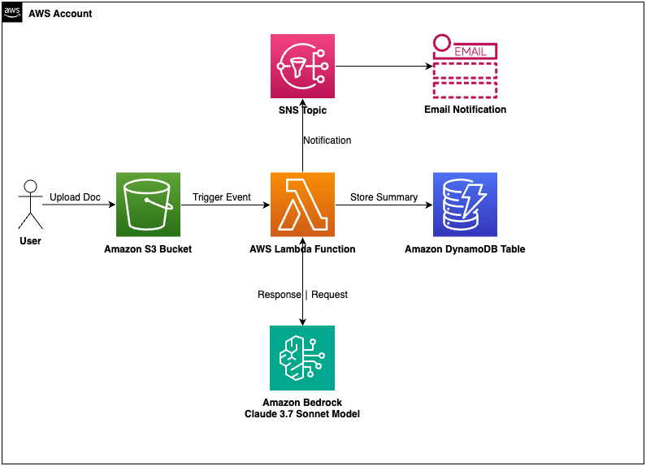

# doc-summary-app-claude-aws
Sample app for Document Summarization System with Claude 3.7 Sonnet on AWS

## Table of Contents

- [Architecture Overview](#architecture-overview)
- [AI Component Details](#ai-component-details)
  - [Amazon Bedrock Integration](#amazon-bedrock-integration)
  - [Lambda Function](#lambda-function-document_processor_aipy)
  - [AI Summary Generation](#ai-summary-generation)
  - [Prompt Engineering](#prompt-engineering)
  - [Model Parameters](#model-parameters)
- [Security and Permissions](#security-and-permissions)
- [Advantages of Claude 3.7 Sonnet](#advantages-of-claude-37-sonnet)
  - [Enhanced Summary Quality](#enhanced-summary-quality)
  - [Comparison with Other Models](#comparison-with-other-models)
- [Deployment Considerations](#deployment-considerations)
  - [Model Access](#model-access)
  - [Inference Profiles](#inference-profiles)
  - [Cost Considerations](#cost-considerations)
- [Future Enhancements](#future-enhancements)
- [Setup Guide](#ai-powered-document-summarization-application---setup-guide)
  - [Prerequisites](#prerequisites)
  - [Deployment Steps](#deployment-steps)
  - [Testing the Application](#testing-the-application)
  - [Monitoring and Troubleshooting](#monitoring-and-troubleshooting)
  - [Customization](#customization)
  - [Cleanup](#cleanup)
  - [Additional Resources](#additional-resources)

## Architecture Overview

The application uses a serverless architecture with the following AWS services:

1. **Amazon S3**: Stores the uploaded documents
2. **AWS Lambda**: Processes the documents and orchestrates the workflow
3. **Amazon Bedrock**: Provides the Claude 3.7 Sonnet AI model for generating high-quality summaries
4. **Amazon DynamoDB**: Stores the document summaries
5. **Amazon SNS**: Sends notifications when summaries are ready



## AI Component Details

### Amazon Bedrock Integration

The application uses Amazon Bedrock to access the Claude 3.7 Sonnet model, which is specifically designed for advanced language understanding and generation tasks:

- **Claude 3.7 Sonnet**: A powerful AI model that excels at summarization, reasoning, and content generation with a large context window
- **Bedrock Runtime API**: Provides a simple interface for invoking the model
- **Prompt Engineering**: Carefully crafted prompts to generate high-quality summaries

### Lambda Function (`document_processor_ai.py`)

The Lambda function is triggered when a document is uploaded to the S3 bucket. It performs the following steps:

1. **Extract Document Information**: Gets the bucket name and object key from the event
2. **Download Document**: Retrieves the document content from S3
3. **Generate AI Summary**: Sends the document content to Claude 3.7 Sonnet via Amazon Bedrock
4. **Store Summary**: Saves the AI-generated summary to DynamoDB
5. **Send Notification**: Publishes a message to the SNS topic

#### AI Summary Generation

The AI-powered implementation uses Claude 3.7 Sonnet to generate high-quality summaries:

```python
def generate_summary_with_bedrock(document_content):
    """
    Generate a summary of the document content using Claude 3.7 Sonnet on Amazon Bedrock.
    """
    # Truncate document content if it's too long
    max_chars = 150000  # Claude 3.7 can handle larger contexts
    if len(document_content) > max_chars:
        document_content = document_content[:max_chars] + "..."
    
    # Create the prompt for Claude
    prompt = f"""
    Please provide a comprehensive summary of the following document. 
    Focus on the main points, key findings, and important details.
    The summary should be well-structured and capture the essence of the document.
    
    DOCUMENT:
    {document_content}
    
    SUMMARY:
    """
    
    # Use Claude format
    request_body = CLAUDE_FORMAT.copy()
    request_body["messages"][0]["content"] = prompt
    
    # Invoke the Claude 3.7 Sonnet model
    response = bedrock_runtime.invoke_model(
        modelId=INFERENCE_PROFILE,
        body=json.dumps(request_body)
    )
    
    # Parse the response
    response_body = json.loads(response['body'].read())
    
    # Extract summary from Claude format response
    if 'content' in response_body and isinstance(response_body['content'], str):
        return response_body['content'].strip()
    
    # Handle other response formats...
```

### Prompt Engineering

The prompt is designed to guide the Claude 3.7 Sonnet model to generate comprehensive and well-structured summaries:

1. **Clear Instructions**: Explicitly asks for a comprehensive summary
2. **Focus Areas**: Directs the model to focus on main points, key findings, and important details
3. **Structure Guidance**: Requests a well-structured summary that captures the essence of the document

### Model Parameters

The application uses specific parameters to control the behavior of the Claude 3.7 Sonnet model:

- **max_tokens**: 4000 - Allows for longer, more detailed summaries
- **temperature**: 0.2 - Lower temperature for more focused and deterministic outputs
- **anthropic_version**: "bedrock-2023-05-31" - Specifies the API version for Claude models

## Security and Permissions

The application includes specific permissions for Amazon Bedrock:

```yaml
Policies:
  - Version: '2012-10-17'
    Statement:
      - Effect: Allow
        Action:
          - bedrock:InvokeModel
        Resource: '*'
```

## Advantages of Claude 3.7 Sonnet

### Enhanced Summary Quality

The Claude 3.7 Sonnet model provides several advantages for document summarization:

1. **Larger Context Window**: Can process up to 150,000 characters, allowing for longer documents
2. **Advanced Language Understanding**: Better comprehension of complex documents and technical content
3. **Improved Coherence**: Generates more coherent and well-structured summaries
4. **Better Information Extraction**: More accurate identification of key points and important details
5. **Nuanced Understanding**: Better grasp of subtle points and implicit information

### Comparison with Other Models

| Feature | Basic AI Models | Claude 3.7 Sonnet |
|---------|----------------|-------------------|
| Context Window | Typically 8K-32K tokens | Up to 150K characters |
| Summary Quality | Good | Excellent |
| Comprehension | Basic understanding | Deep contextual understanding |
| Structure | May be inconsistent | Well-structured and organized |
| Technical Content | May struggle | Handles technical content well |
| Reasoning | Limited | Advanced reasoning capabilities |

## Deployment Considerations

### Model Access

Before deploying the application, ensure that:

1. Amazon Bedrock service is enabled in your AWS account
2. You have requested access to the Claude 3.7 Sonnet model in the Bedrock console
3. Your AWS credentials have permission to use Bedrock

### Inference Profiles

The application uses inference profiles to optimize model invocation:

1. **Creating an Inference Profile**: The setup script creates a dedicated inference profile for Claude 3.7 Sonnet
2. **Benefits**: Improved reliability, better error handling, and consistent performance
3. **Fallback Mechanism**: Direct model invocation as a fallback if the inference profile fails

### Cost Considerations

The AI-powered implementation has cost considerations:

- **Amazon Bedrock Usage**: Charges based on the number of tokens processed
- **Claude 3.7 Sonnet**: Higher quality but potentially higher cost than simpler models
- **Inference Profiles**: May have associated costs depending on your AWS configuration

## Future Enhancements

Potential enhancements to the AI-powered application include:

1. **Multi-Document Summarization**: Summarize multiple related documents together
2. **Custom Summary Styles**: Allow users to specify different summary styles (executive, detailed, bullet points)
3. **Multi-Language Support**: Add support for summarizing documents in multiple languages
4. **Document Analysis**: Deeper analysis of document structure, sentiment, and key entities
5. **Interactive Summaries**: Allow users to ask follow-up questions about the summarized documents
6. **Summary Customization**: Enable users to specify aspects of the document they want emphasized in the summary

# AI-Powered Document Summarization Application - Setup Guide

This guide will walk you through setting up and deploying the AI-powered Document Summarization Application on AWS, which uses Claude 3.7 Sonnet on Amazon Bedrock for intelligent document summarization.

## Prerequisites

Before you begin, make sure you have the following:

1. **AWS Account**: You need an AWS account with appropriate permissions to create resources.

2. **AWS CLI**: Install and configure the AWS Command Line Interface.
   ```bash
   pip install awscli
   aws configure
   ```

3. **AWS SAM CLI**: Install the AWS Serverless Application Model CLI.
   ```bash
   pip install aws-sam-cli
   ```

4. **Python 3.13**: The Lambda function uses Python 3.13.

5. **Amazon Bedrock Access**: Ensure you have access to Amazon Bedrock and the Claude 3.7 Sonnet model.
   - Go to the AWS Management Console
   - Navigate to Amazon Bedrock
   - Click on "Model access" in the left navigation
   - Request access to the Claude 3.7 Sonnet model if you haven't already

## Deployment Steps

### 1. Clone the Repository

Clone or download [this repository](https://github.com/zechariahks/doc-summary-app-claude-aws.git) to your local machine.

### 2. Enable Amazon Bedrock Access

Before deploying the application, make sure you have enabled Amazon Bedrock in your AWS account:

1. Go to the AWS Management Console
2. Navigate to Amazon Bedrock
3. Complete the onboarding process if you haven't already
4. Go to "Model access" in the left navigation
5. Find "Claude 3.7 Sonnet" and click "Access model"
6. Accept the terms and conditions
7. Wait for access to be granted (this may take a few minutes)

### 3. Deploy the Application

Run the AI setup script to deploy the application:

```bash
chmod +x setup.sh
./setup.sh
```

The script will:
- Check if Amazon Bedrock is enabled in your account
- Verify access to the Claude 3.7 Sonnet model
- Build the application using AWS SAM
- Deploy the CloudFormation stack
- Create the necessary resources (S3 bucket, Lambda function, DynamoDB table, SNS topic)
- Provide you with the resource names and ARNs

### 4. Subscribe to Notifications

To receive notifications when documents are processed:

1. Use the SNS topic ARN provided after deployment
2. Subscribe your email or other endpoint to the topic:
   ```bash
   aws sns subscribe \
       --topic-arn <TOPIC_ARN> \
       --protocol email \
       --notification-endpoint your-email@example.com
   ```
3. Confirm the subscription by clicking the link in the email you receive

### 5. Upload Documents

Upload documents to the S3 bucket to trigger the AI processing:

```bash
aws s3 cp your-document.pdf s3://<BUCKET_NAME>/
```

The application supports the following document types:
- PDF (.pdf)
- Text files (.txt)
- Word documents (.docx)

### 6. View AI-Generated Summaries

You can view the AI-generated document summaries in the DynamoDB table:

```bash
aws dynamodb scan --table-name AIDocumentSummaries
```

## Testing the Application

### Upload a Sample Document

To test the application with a sample document:

1. Create a sample text file:
   ```bash
   cat > sample_document.txt << EOL
   # Sample Document for AI Summarization

   ## Introduction
   This is a sample document to test the AI-powered document summarization application using Claude 3.7 Sonnet on Amazon Bedrock.

   ## Key Points
   1. The application uses serverless architecture on AWS
   2. Documents are uploaded to an S3 bucket
   3. A Lambda function processes the documents
   4. Claude 3.7 Sonnet on Amazon Bedrock generates intelligent summaries
   5. Summaries are stored in DynamoDB
   6. Notifications are sent via SNS

   ## Benefits
   - Automated document processing
   - High-quality AI-generated summaries with Claude's advanced language capabilities
   - Larger context window handling (up to 150,000 characters)
   - Improved comprehension and summarization accuracy
   - Scalable serverless architecture
   - Real-time notifications

   ## Conclusion
   This sample demonstrates how Claude 3.7 Sonnet can be used to extract meaningful insights from documents automatically.
   EOL
   ```

2. Upload the sample document:
   ```bash
   aws s3 cp sample_document.txt s3://<BUCKET_NAME>/
   ```

3. Wait for the notification (this may take a minute or two)

4. Check the DynamoDB table for the summary:
   ```bash
   aws dynamodb scan --table-name AIDocumentSummaries
   ```

## Monitoring and Troubleshooting

### Monitoring Lambda Execution

To monitor the Lambda function execution:

1. Go to the AWS Management Console
2. Navigate to CloudWatch
3. Go to "Log groups"
4. Find the log group for your Lambda function: `/aws/lambda/ai-document-summarization-app-DocumentProcessorFunction`
5. View the logs to see the execution details

### Common Issues and Solutions

1. **Bedrock Access Error**:
   - Error: "User is not authorized to access this resource"
   - Solution: Ensure you have enabled Amazon Bedrock and have access to the Claude 3.7 Sonnet model

2. **Document Processing Error**:
   - Error: "Error processing document"
   - Solution: Check the CloudWatch logs for detailed error messages

3. **Model Invocation Error**:
   - Error: "Error invoking model"
   - Solution: Verify that the Claude 3.7 Sonnet model is available in your region and you have access to it

4. **Document Format Error**:
   - Error: "Error reading document content"
   - Solution: Ensure the document is in a supported format and is properly encoded

### Checking Bedrock Model Access

To verify that you have access to the Claude 3.7 Sonnet model:

```bash
aws bedrock list-foundation-models --query "modelSummaries[?modelId=='anthropic.claude-3-7-sonnet-20250219-v1:0']" --output text
```

If this command returns information about the model, you have access. If it returns an empty result or an error, you need to request access to the model.

## Customization

### Modifying the Prompt

To customize the prompt used for summarization:

1. Edit `src/document_processor_ai.py`
2. Modify the `prompt` variable in the `generate_summary_with_bedrock()` function:
   ```python
   prompt = f"""
   Please provide a comprehensive summary of the following document.
   Focus on [YOUR CUSTOM INSTRUCTIONS HERE].
   
   DOCUMENT:
   {document_content}
   
   SUMMARY:
   """
   ```

### Adjusting Model Parameters

To adjust the Claude 3.7 Sonnet model parameters:

1. Edit `src/document_processor_ai.py`
2. Modify the parameters in the `request_body` dictionary:
   ```python
   request_body = {
       "anthropic_version": "bedrock-2023-05-31",
       "max_tokens": 4000,  # Adjust the maximum length of the summary
       "temperature": 0.2,  # Adjust for creativity (higher) vs. determinism (lower)
       "messages": [
           {
               "role": "user",
               "content": prompt
           }
       ]
   }
   ```

## Cleanup

To remove all resources created by this application:

```bash
aws cloudformation delete-stack --stack-name ai-document-summarization-app
```

## Additional Resources

- [Amazon Bedrock Documentation](https://docs.aws.amazon.com/bedrock/)
- [Claude 3.7 Sonnet Model Information](https://aws.amazon.com/bedrock/claude/)
- [AWS Serverless Application Model (SAM) Documentation](https://docs.aws.amazon.com/serverless-application-model/)
- [Amazon S3 Documentation](https://docs.aws.amazon.com/s3/)
- [Amazon DynamoDB Documentation](https://docs.aws.amazon.com/dynamodb/)
- [Amazon SNS Documentation](https://docs.aws.amazon.com/sns/)
